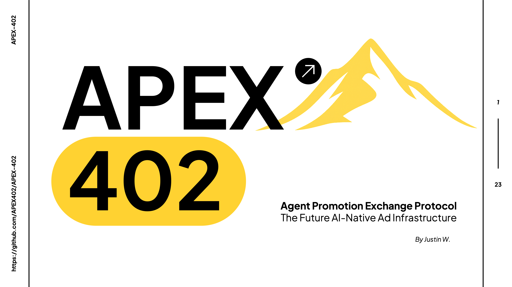

# APEX-Monorepo



This is the monorepo for APEX-402 protocol, which contains the merchant demo, client demo, and APEX-402 implementation. All three submodules are combined here for hackathon submission.

## What is APEX-402?

APEX-402 is a protocol based on x402, enabling AI agent to receive Ads content from MCP server, tracking user interactions after AI recommendation, and facilitating trustless ad payment settlement.

## Public Demo

You can access our public demo via [link](https://client-demo-beige.vercel.app/). The ad settlement credit can be found via [BscScan](https://testnet.bscscan.com/address/0x268DE765aeC0799CEAE45012F4C73f823d146c21).

## Quickstart

1. Clone the repository:
```bash
git clone --recurse-submodules git@github.com:hwjustin/APEX-Monorepo.git
cd APEX-Monorepo
```

2. APEX-402 Facilitator Deployment:

```bash
cd APEX-402
git checkout publish
git pull
```

```bash
docker build \
  --no-cache \
  --target facilitator \
  -t q402-facilitator \
  -f Dockerfile .
```

```bash
docker run -d \
  --name q402-facilitator \
  --restart unless-stopped \
  --env-file ./facilitator.env \
  -p 8080:8080 \
  q402-facilitator
```

3. Client Demo Deployment:

```bash
cd client-demo
pnpm install
pnpm dev
```


4. Merchant Demo Deployment:

```bash
cd merchant-demo
pnpm install
pnpm dev
```

## Acknowledgement

APEX-402 is built based on the [q402 protocol](https://github.com/quackai-labs/Q402) by Quack AI and BNB Chain. We thank the original developer for their fundamental and open-sourced work.
